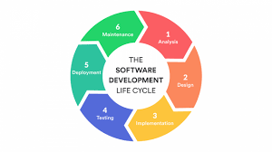

# Implantação do Software

## Etapas do Processo de Desenvolvimento de Software

### 1.	Análise de Requisitos do Cliente

1.1 Identificação, análise das necessidades e dos problemas de acordo com relatos obtidos do cliente.

1.2 Elaboração da documentação de contexto e referências para a execução do software.

### 2.	Design
2.1 Descrição de histórias de usuário com informações sobre as características e necessidades de cada usuário que podem contribuir para o desenvolvimento do software.

2.2 Definição dos Requisitos Funcionais e Não-Funcionais.

### 3.	Implementação

3.1   Organização das etapas de desenvolvimento em sprints para implementação dos requisitos.

3.2 Construção da estrutura lógica do software.

3.2 Divisão do desenvolvimento do software em front-end (interface), back-end (lógica de negócios) e database (bando de dados)

### 4.	Teste

4.1 Testes realizados em ambiente específico para verificar se o software cumpre os requisitos.

4.2 Simulação de diversos casos de teste do software para evitar problemas na execução.

### 5.	Implantação

5.1 Apresentação do software ao cliente pelo time de desenvolvimento para garantir a qualidade do produto e satisfação do cliente.

5.2. Avaliação da equipe de desenvolvimento junto ao cliente para saber se o sofrware atende as expectativas do cliente.

5.3 Correções realizadas se necessário, antes da publicação.

5.4 Publicação do software após a garantia de que ele alcançou os resultados esperados.

5.5 Realização de treinamentos ou tutoriais disponibilizados se necessário para possibilitar a melhor adaptação do cliente ao software.

# Utilização das Tecnologias no Desenvolvimento de Software

Visual Studio Code(desenvolvimento do código)

Typescript e React native Expo(front-end)

Asp .Net Core 6(back-end)

MySQL para Banco de Dados

